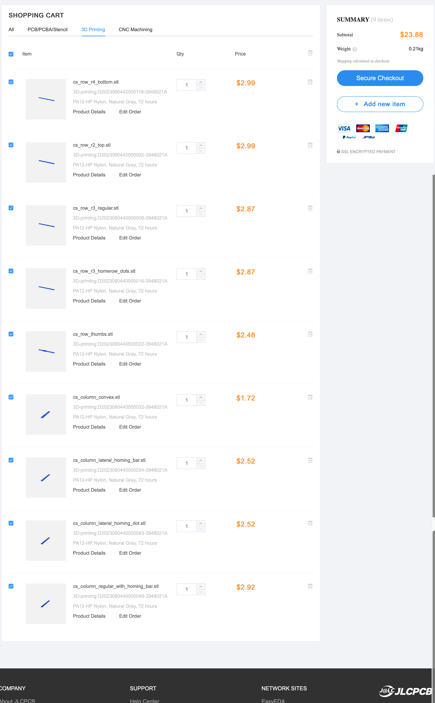

# Chicago Stenographer Keycaps - Optimized for JLCPCB 3D printing

This fork combines multiple chicago stenographer keycaps with sprues into one file to get around the $1 minimum charge of JLCPCB.

If you like these keycaps after trying the 3D printed version, [consider buying artisan verions from the creator at asymplex.xyz](https://www.asymplex.xyz).

## Table Of Contents
1. [Table Of Contents](#table-of-contents)
2. [Photos](#photos)
    1. [Render](#render)
    2. [Printed](#printed)
3. [About this fork](#about-this-fork)
4. [Documentation](#documentation)
    1. [Keycap Types](#keycap-types)
        1. [R2 Keycaps - Top and bottom](#r2-keycaps---top-and-bottom)
        2. [R3 Keycaps - Middle rows and home row](#r3-keycaps---middle-rows-and-home-row)
        3. [Thumb Keycaps](#thumb-keycaps)
        4. [1.5u Thumb Key](#15u-thumb-key)
        5. [Concave Keycaps](#concave-keycaps)
        6. [Levee Keycaps](#levee-keycaps)
    2. [What to print...](#what-to-print)
        1. [If you have a 5x3 row board (Such as the corne without the outer coulmn)](#if-you-have-a-5x3-row-board-such-as-the-corne-without-the-outer-coulmn)
        2. [If you have a 6x3 row board (Such as the corne WITH the outer coulmn)](#if-you-have-a-6x3-row-board-such-as-the-corne-with-the-outer-coulmn)
        3. [If you have a 6x4 board with a num row...](#if-you-have-a-6x4-board-with-a-num-row)
    3. [How to order on JLCPCB](#how-to-order-on-jlcpcb)
        1. [JLCPCB Shopping Cart Example](#jlcpcb-shopping-cart-example)
    4. [How to create custom sets of keycaps](#how-to-create-custom-sets-of-keycaps)

## Photos

### Render

Subtly sculpted choc spaced low profile

### Printed

## About this fork

This is a fork of [sporkus/PseudoMakeMeKeyCapProfiles](https://github.com/sporkus/PseudoMakeMeKeyCapProfiles/), which is a fork of [pseudoku's original chicago stenographer keycaps](https://github.com/pseudoku/PseudoMakeMeKeyCapProfiles).

Sporkus is the one who came up with the idea and the code to add spuers to the keycaps.

I expanded on those efforts in the following ways...

* Added support to generate rows of varying keycaps
* Fixed the 1.5u inner thumb key that is used in many corne-like boards
* Added documentation on how to print the keycaps

## Documentation

### Keycap Types

When I first started looking into these keycaps, I was incredibly confused by all the available keycap variations and files.

This repo is my attempt to simplify and document what I learned.

You can find all the files in the [stl directory.](./stl/)

#### R2 Keycaps - Top and bottom

You use these keycaps for the top and bottom rows of your keyboard.

They are rotatable. So, to use them on the top row, you just rotate them by 180 degrees.

If your keyboard has a num row, you would use them for the num row and the bottom alpha row.

If you have a corne-style keyboard with just three rows, you would use it for the top and bottom alpha rows.

#### R3 Keycaps - Middle rows and home row

You use these keycaps for the columns between the top and bottom rows.

If you have a num row, you would use it for the top alpha row and the homerow.

If you have a corne-style keyboard with just three rows, you would use it just for the home row.

#### Thumb Keycaps

The thumb keycaps are designed to create a "dish" with ridges on the outer thumb keys.

The same model is used for the left and right keys, but it is mirrored. In this repo you will find a model that already has all the versions you will need.

If you have a corne-style thumb cluster with 3 keys, you can use a concave key for the middle one. It will act like a homing key.

You can use the R2 or R3 variation of it. The R2 is slightly higher. Both are included in the thumbs file.

#### 1.5u Thumb Key

Additionally, there are also 1.5u variations of the outer thumb keys.

You have to be very careful if you get the files from other repos, because by default the stem is rotated by 90 degrees unlike regular 1.5u keys.

The files here have the stem in the correct orientation for keyboards like the corne where the switch is already rotated by 90 degrees.

#### Concave Keycaps

The concave keys are used on the middle thumb keys, but can also optionally be used on the inner and outer columns.

You can [see an example of how that looks here](https://www.printables.com/model/158865-chicago-steno-low-profile-ergo-keycaps).

#### Levee Keycaps

Steno keycaps have vertical ridges that keep your finger aligned in the row. This is great, but some people prefer to not have these ridges for the inner and outer columns so that they don't have to lift the finger to reach the side-key.

Keep in mind, that the levee keycaps are a combo of both the outer and pinky key.

The file contains only one set of the two. If you want it on both sides of the keyboard, you have to print it twice.

### What to print...

You can find all files in the stl directory. You can also look at the `export_cs_*.scad` files to see what key models were used and further comments on how to use the sets.

#### If you have a 5x3 row board (Such as the corne without the outer coulmn)

* 2x `cs_row_r2_top_bottom.scad`
* 1x `cs_row_r3_homerow_bar.scad` or `cs_row_r3_homerow_dots.scad` (different homing keys)
  * Or the `cs_row_r3_regular.scad` and `cs_row_r3_homing_only.stl` to get both homing key variations
* 1x cs_row_thumbs.scad`

#### If you have a 6x3 row board (Such as the corne WITH the outer coulmn)

All of the above, PLUS...

* 1x `cs_column_regular.stl` or `cs_column_concave.stl` for the outer pinky column

You can also print the `cs_column_regular_with_homing_bars.stl` variation which contains two more homing key.

Combine it with the `cs_row_r3_homerow_dots.scad` to get both homing key variations without needing to print them separately.

Alternatively, you can also consider the leeve variation, but this one needs to be printed twice as it should be used on both the outer and pinky keys.

So...

* 2x `export_cs_column_levee.scad`

The leeve rows can also be used for the index and inner column as the stl includes homing key variations.

#### If you have a 6x4 board with a num row...

All of the above, PLUS...

* 1x `cs_row_r3_regular.stl` for the top alpha row (the r2 keycaps will be used for the num row)

### How to order on JLCPCB

* Upload the stl model
* Select 3D Technology: `MJF (Nylon)`
* Select Material: `PA12-HP Nylon`
* Optionally select Surface Finish: `Add - Dyeing - Dyed Black` to get black keycaps.
  * Without this they will be a "textured gray"
* Make sure to select the correct Quantity

The total for a 6x4 board with all the optional stuff will cost $23.86 + shipping.

#### JLCPCB Shopping Cart Example

### How to create custom sets of keycaps

* Install OpenSCAD
  * The [snaphot version](https://openscad.org/downloads.html#snapshots) is recommended for performance reasons
  * If it crashes, [try an older version of the snapshot](https://files.openscad.org/snapshots/)
* Set up the dev environment
  * Adjust the Makefile with the path to your OpenSCAD installation
  * Unzip the `libraries.zip` into your [OpenSCAD library path](https://en.wikibooks.org/wiki/OpenSCAD_User_Manual/Libraries)
* Create your keycap set
  * Copy one of the files starting with `export_`
  * Adjust the keycaps you want to use. Available options are in `gen_sprued_keycaps.scad`
  * Keep in mind that jlcpcb only allows a maximum of 10 keycaps per file
* Generate STLs
  * Run `make` and it will generate all missing STLs
  * Alternatively you can also select which file to generate by running something like `make stl/cs_row_thumbs.stl`, but keep in mind that you have to use the file name of the final stl file and not of the source `.scad` file

Alternatively you can also run the GUI version, but it's a bit slow.

You can speed it up by enabling the `manifold` options in `Preferences -> Features` (Snapshot version only).
